# Mini Account Management System

A simple account management system built with ASP.NET Core Razor Pages, designed to handle basic accounting functionalities with robust security features using ASP.NET Identity. Database operations are exclusively managed through SQL Server Stored Procedures, demonstrating a strong adherence to backend logic encapsulation.

## Table of Contents

- [Features](#features)
- [Tech Stack](#tech-stack)
- [Core Implementations](#core-implementations)
- [Getting Started](#getting-started)
- [Prerequisites](#prerequisites)
- [Database Setup](#database-setup)
- [Running the Application](#running-the-application)
- [Default Users for Testing](#testing--admin-access)
- [Screenshots](#screenshots)
- [Future Enhancements](#future-enhancements)


## Features

- **User Authentication & Authorization**: Secure user registration and login powered by ASP.NET Identity.
- **Role-Based Access Control**: Differentiated access levels for Admin, Accountant, and Viewer roles.
- **Custom Role Management**: Admins can assign specific roles and module access rights to users.
- **Chart of Accounts Management**:
    - Comprehensive CRUD operations (Create, Read, Update, Delete) for accounts (e.g., Cash, Bank, Receivables).
    - Supports hierarchical (Parent/Child) display for better account organization.
- **Voucher Entry Module**:
    - Support for various voucher types: Journal Vouchers, Payment Vouchers, and Receipt Vouchers.
    - Dynamic multi-line entries for Debit and Credit amounts.
    - Account selection via dropdowns.
    - Automatic validation to ensure total debits equal total credits.
- **Stored Procedure-Driven Database Access**: All database interactions are exclusively handled via SQL Server Stored Procedures, ensuring data integrity and performance.

## Tech Stack

- **ASP.NET Core 8**: Modern, high-performance, and cross-platform framework for building web applications.
- **Razor Pages**: An easy-to-use framework for building web UI with ASP.NET Core.
- **MS SQL Server**: Relational database management system for data storage.
- **Stored Procedures**: All database operations are encapsulated in stored procedures for enhanced security and performance.
- **ASP.NET Identity**: Robust framework for managing users, passwords, profile data, roles, and claims.
- **Git + GitHub**: Version control system and platform for source code management.

## Core Implementations

Based on the project requirements, the following core features have been implemented:

### 1. User Roles & Permissions
- Implemented ASP.NET Identity with custom roles: `Admin`, `Accountant`, `Viewer`.
- **Module Access Assignment**: Admins can assign specific access rights to various modules for different users through a dedicated interface, driven by stored procedures.

### 2. Chart of Accounts
- **CRUD Operations**: Complete functionality to Create, Update, and Delete accounts.
- **Stored Procedure**: Utilizes `sp_ManageChartOfAccounts` for all account management operations.
- **Hierarchical Display**: Accounts are displayed in a tree-like (Parent/Child) structure, enhancing readability and navigation.

### 3. Voucher Entry Module
- **Voucher Types**: Supports `Journal`, `Payment`, and `Receipt` vouchers.
- **Form Design**:
    - **Date**: Input field for the voucher date.
    - **Reference No.**: Field for unique reference numbers.
    - **Debit & Credit Entries**: Dynamic multi-line table for adding multiple debit and credit entries.
    - **Account Selection**: Dropdown list populated with accounts from the Chart of Accounts.
- **Validation**: Client-side (JavaScript) and server-side validation ensure that an entry cannot have both debit and credit amounts, and total debits must always equal total credits.
- **Stored Procedure**: `sp_SaveVoucher` handles the complete process of saving a voucher and its associated entries to the database.

## Getting Started

Follow these instructions to get a copy of the project up and running on your local machine for development and testing purposes.

### Prerequisites

Before you begin, ensure you have the following installed:

- [.NET 8 SDK](https://dotnet.microsoft.com/download/dotnet/8.0) or higher.
- [SQL Server](https://www.microsoft.com/en-us/sql-server/sql-server-downloads) (Express, Developer, or full edition).
- [Visual Studio 2022](https://visualstudio.microsoft.com/downloads/) (recommended) or [VS Code](https://code.visualstudio.com/download) with C# extensions.

### Database Setup

1.  **Create Database**: Create a new SQL Server database. A suitable name would be `MiniAccountSystemDB`.
2.  **Update Connection String**: Open `appsettings.json` in the `MiniAccountSystem` project and update the `DefaultConnection` string to point to your SQL Server instance:
    ```json
    "ConnectionStrings": {
        "DefaultConnection": "Server=YourServerName;Database=MiniAccountSystemDB;Trusted_Connection=True;MultipleActiveResultSets=true;TrustServerCertificate=True;"
        // Replace 'YourServerName' with your SQL Server instance name (e.g., DESKTOP-XXXXXX\SQLEXPRESS or localhost)
    }
    ```
3.  **Run Migrations**: Open your terminal or command prompt in the `MiniAccountSystem` project directory and run the following command to apply ASP.NET Identity database migrations:
    ```bash
    dotnet ef database update
    ```
4.  **Create Stored Procedures**: Execute the SQL scripts for your stored procedures (`sp_ManageChartOfAccounts`, `sp_SaveVoucher`, and any other necessary SPs for user/role management, module access, etc.) on your `MiniAccountSystemDB` database. Navigate to the `DatabaseScripts` folder in the cloned repository. Execute all `.sql` script files found in this folder against your `MiniAccountSystemDB` database using SQL Server Management Studio (SSMS) or a similar tool.
 **Ensure you run them in the correct order if there are dependencies (e.g., User-Defined Table Types must be created before Stored Procedures that utilize them).**
    *(For example, run `VoucherEntries_Table.sql` before `sp_SaveVoucher.sql`.)*

### Running the Application

1.  **Clone the repository**:
    ```bash
    git clone [https://github.com/safrinanishi97/MiniAccountSystem.git](https://github.com/safrinanishi97/MiniAccountSystem.git)
    cd MiniAccountSystem
    ```
2.  **Restore NuGet Packages**:
    ```bash
    dotnet restore
    ```
3.  **Run the application**:
    - **Using Visual Studio**: Open the `MiniAccountSystem.sln` file in Visual Studio and press `F5` or click the "Run" button.
    - **Using Command Line**:
      ```bash
      dotnet run
      ```
4.  The application will typically launch on `https://localhost:7154` (or another assigned port). Check the console output for the exact URL.


## Default Users for Testing

For easy testing of different roles and permissions, the application is pre-seeded with the following default users:

| Role        | Username             | Password      | Accessible Modules (via `sp_AssignUserAccess`) |
| :---------- | :------------------- | :------------ | :--------------------------------------------- |
| **Admin** | `safrina@gmail.com`  | `Safrina@123` | ChartOfAccounts, VoucherEntry, User/Role Management |
| **Accountant** | `accountant1@gmail.com` | `Account@123` | VoucherEntry                                   |
| **Viewer** | `viewer1@gmail.com`  | `Viewer@123`  | ChartOfAccounts                                |


## 📸 Screenshots

### 🏠 Home Page  
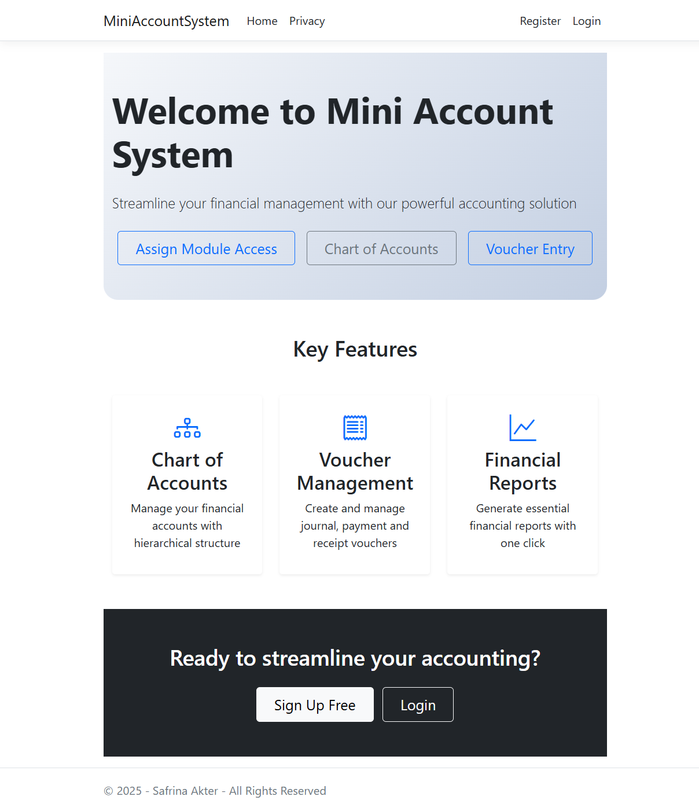

### 🏠 Admin-Home Page  
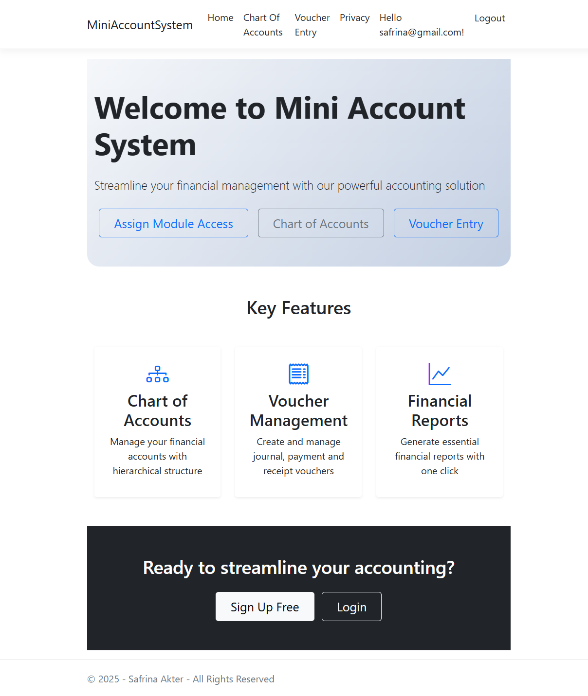

### 🧾 AssignModuleAccess Page  
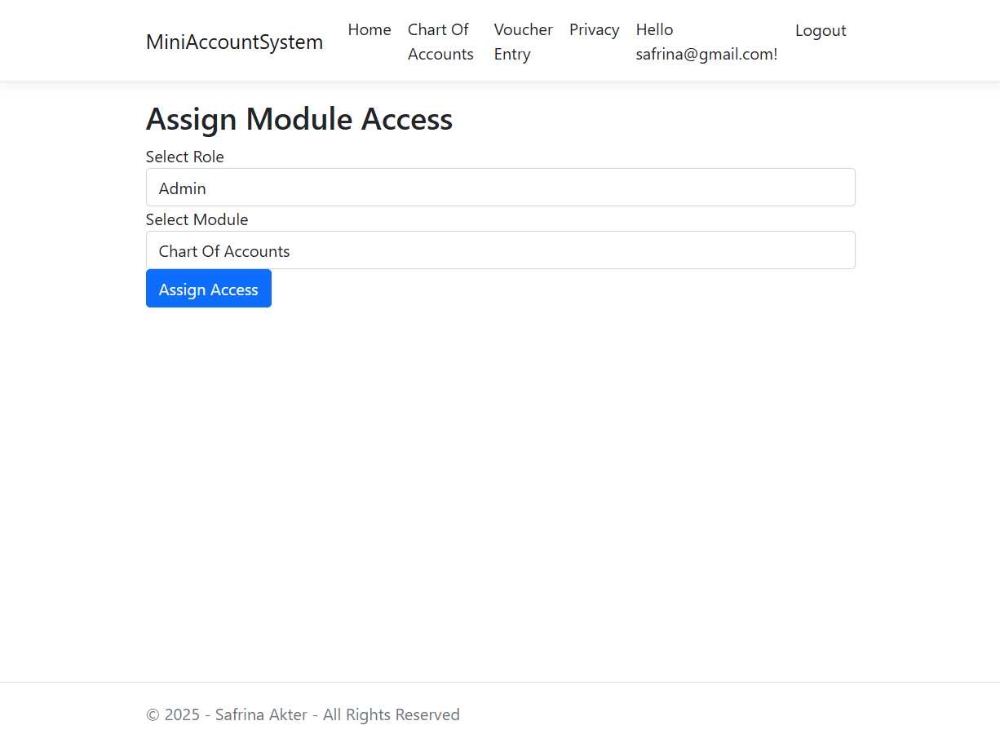

### 🧾 Account_Login_AssignModuleAccess Page  
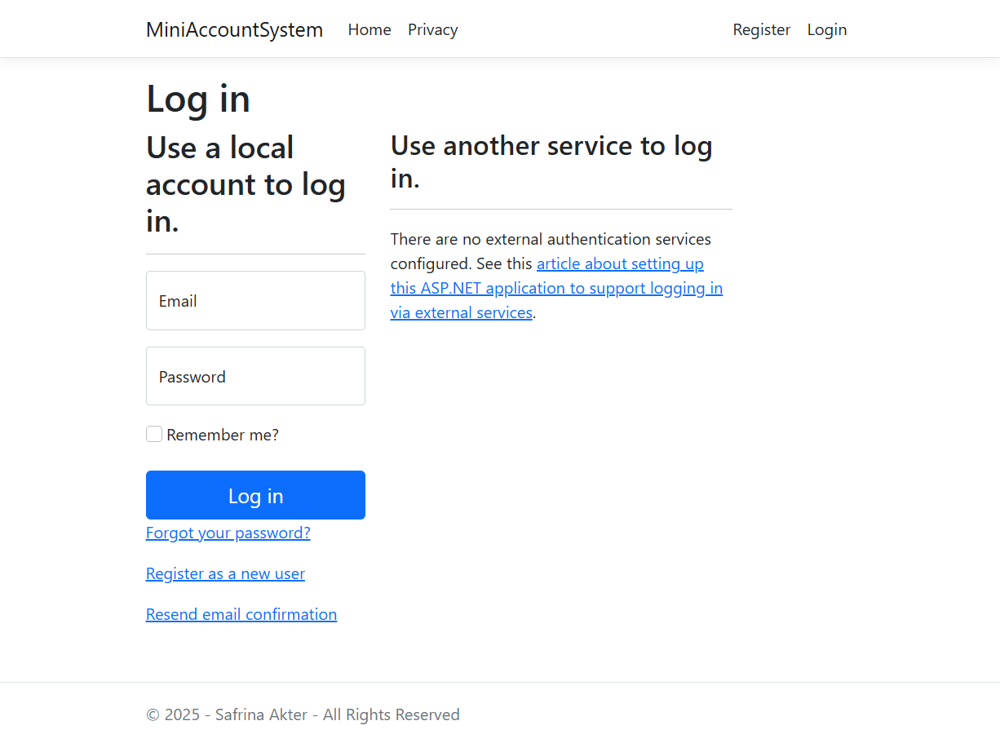

### 🚫 AccessDenied Page  
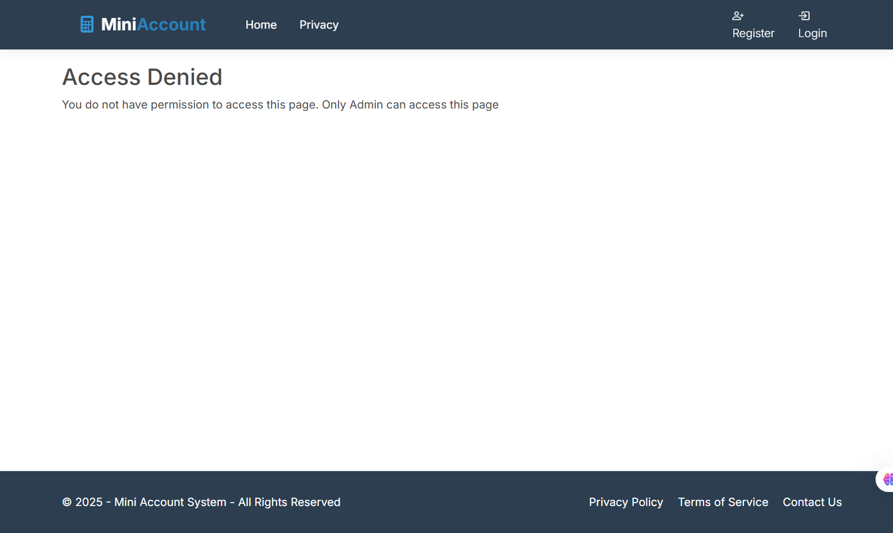

### 🔐 Login Page  
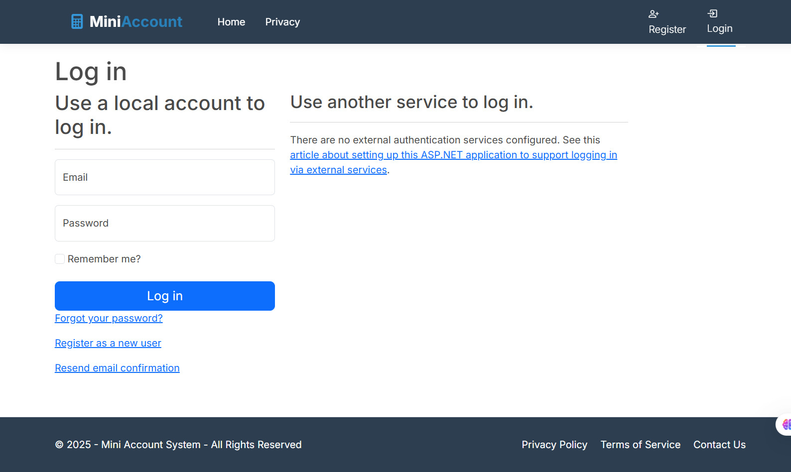

### 🔐 Register Page  
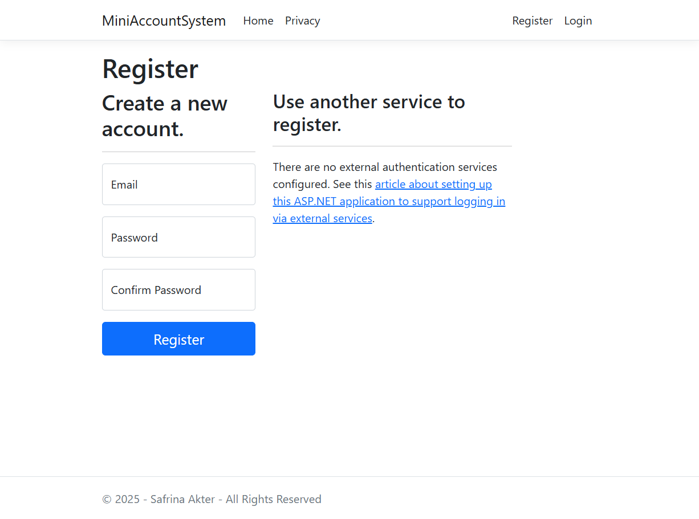

### 🧾 ChartOfAccounts Form  
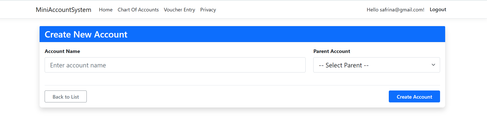

### 🧾 ChartOfAccounts List  
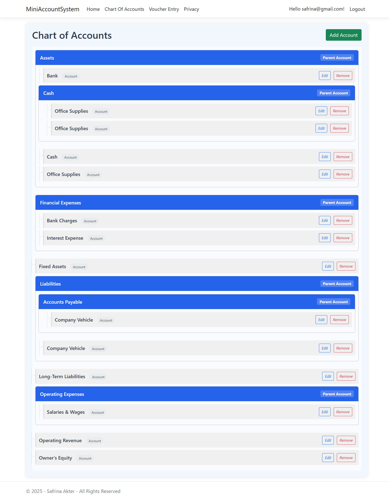

### 🧾 ChartOfAccounts Index  
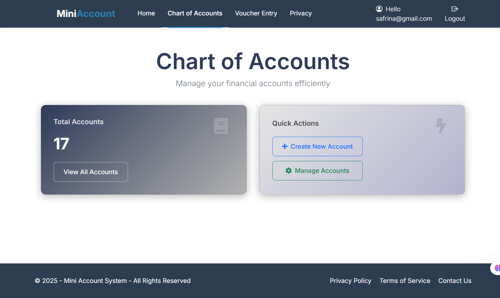

### 🧾 Voucher List  
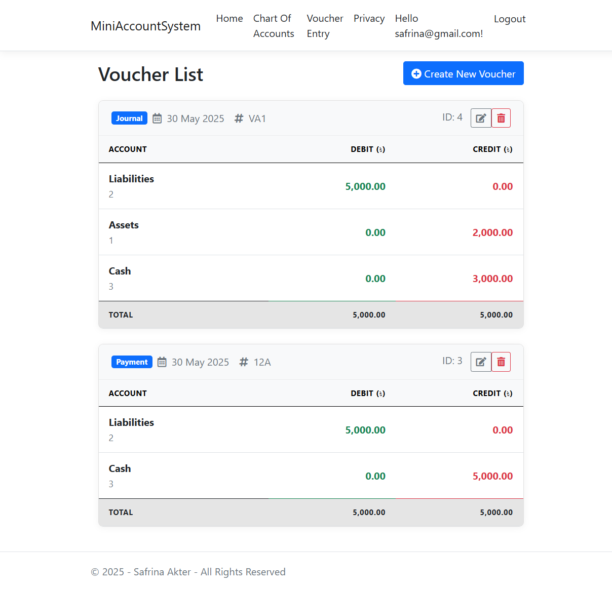

### 🧾 Voucher Entry Form  
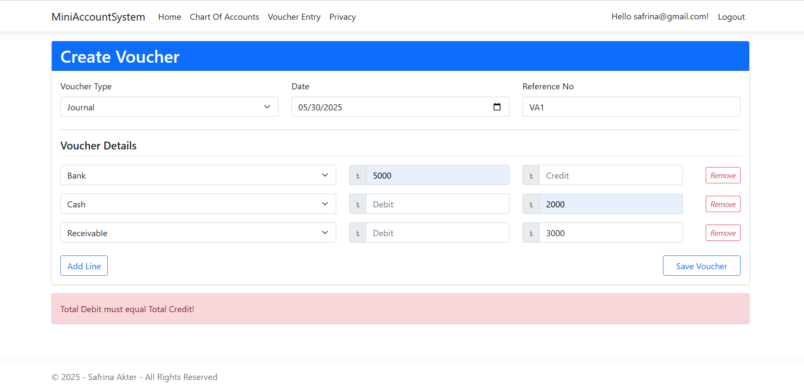

### 🧾 Voucher Edit Form  
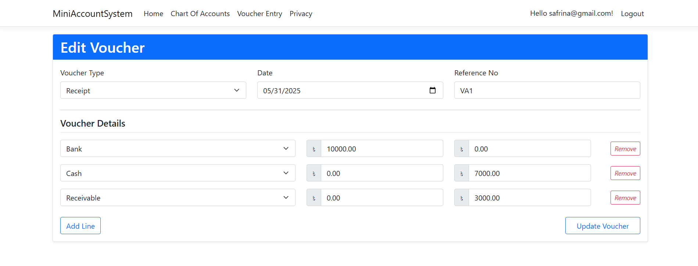


## Future Enhancements
- Implementing comprehensive reporting modules, such as **Trial Balance, General Ledger, Cash Book, Bank Book, and customizable financial statements.**
- Building a dedicated UI for managing users and roles by an Admin, without direct database interaction.
- Enhanced client-side validation and user experience with more immediate feedback.
- Integration with logging frameworks for better error diagnostics and monitoring.
