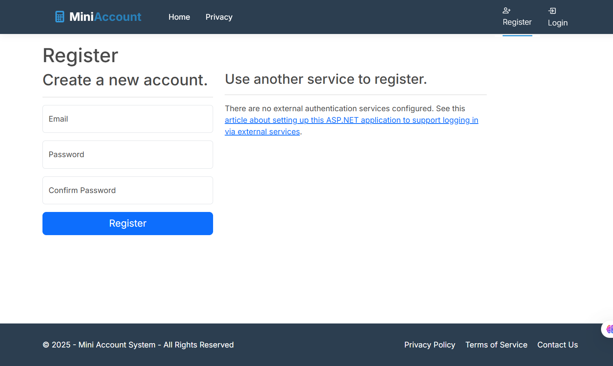
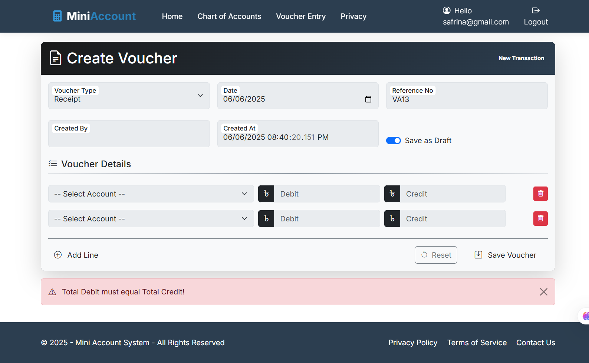

# Mini Account Management System

A simple account management system using ASP.NET Core Razor Pages, SQL Server (Stored Procedures), and ASP.NET Identity with custom role-based authentication.

## Features

- User Registration & Login (ASP.NET Identity)
- Role-Based Access: Admin, Accountant, Viewer
- Chart of Accounts with hierarchical structure
- Voucher Entry (Journal, Payment, Receipt)
- Stored procedure-based database access
- Authentication & Authorization (ASP.NET Identity)


## Tech Stack

- ASP.NET Core 8
- Razor Pages
- SQL Server (Stored Procedures only)
- ASP.NET Identity
- Git + GitHub


1. Clone the repository:
   ```bash
   git clone https://github.com/safrinanishi97/MiniAccountSystem.git


   ## 📸 Screenshots

### Home Page


### Admin-Home Page


### AssignModuleAccess Page


### Account_Login_AssignModuleAccess Page


### AccessDenied Page


### 🔐 Login Page


### 🔐 Register Page


### 🧾 ChartOfAccounts Form


### 🧾 ChartOfAccounts List


### 🧾 ChartOfAccounts Index


### 🧾 Voucher Entry Form
